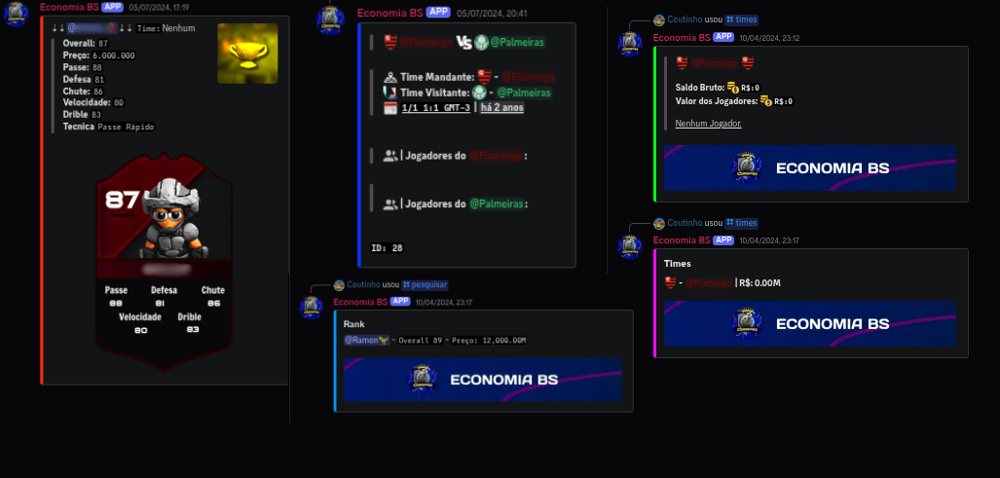

# Champions Bombsquad

🌐 Este README también está disponible en [Inglés 🇺🇸](./README.md) | [Portugués 🇧🇷](./README.pt-br.md)

Champions BS fue un servidor multijugador para BombSquad activo entre 2023 y 2025, enfocado en minijuegos deportivos exclusivos, y tuvo un gran impacto visual y mecánico en la escena de minijuegos deportivos de BombSquad.

## 📦 Stack
- AWS EC2  
- Python + Ballistica API  
- Bots de Discord + Webhooks  
- Sistema de moderación y registros  
- Infraestructura con sesiones tmux para múltiples servidores simultáneos  

## 🧠 Impacto
- Proyecto activo de 2023 a 2025  
- Alta disponibilidad durante su operación  
- Revolucionó el estilo visual y la mecánica de los minijuegos de fútbol en BombSquad  
- Comunidad con más de 600 jugadores en Discord en su punto máximo  
- Más de 3 minijuegos deportivos exclusivos desarrollados  
- Sistema de economía exclusivo para torneos vía bot de Discord  
- Minijuego más vendido del proyecto: **Futgrandão**  

## 🖼️ Vistas previas

### 🎮 Gameplay
- Modos exclusivos como **FutGrandão, Voleibol y Basketball**  
- Experiencia personalizada para BombSquad multijugador

### 🛠️ Panel de Moderación
- Herramientas de administración en tiempo real  
- Sistema de moderación de servidores vía chat

### 🤖 Bot de Economía
- Gestión de monedas en torneos  
- Gestión de jugadores vía Discord  
- Integración completa con Discord

## 🎥 Tráilers

Mira los tráilers oficiales en el canal de YouTube:  
[Champions BombSquad – Canal Oficial](https://www.youtube.com/@ChampionsBombSquad)

*Incluye 2 tráilers oficiales con gameplay y contenido exclusivo.*

## ❌ Código privado por razones comerciales  
Este repositorio es solo para fines de portafolio y presentación.

---

## 👥 Equipo

- Maycon Soares – Fundador y Desarrollador Principal  
- Lucas – Cofundador y Director General  
- Finin – Cofundador y Director General  
- Matrix, Socrates y Leal – Administradores Generales  

## 🌐 Contacto
- 🧠 [LinkedIn](https://linkedin.com/in/devmaycon/)  
- 💻 [GitHub](https://github.com/devmaycon/)  
- 🎮 [YouTube - Champions BombSquad](https://www.youtube.com/@ChampionsBombSquad)

## 🤝 Agradecimientos Especiales
Gracias a todos los que colaboraron y apoyaron este proyecto durante su desarrollo.

---

<b>Gracias por revisar mi proyecto.</b>

