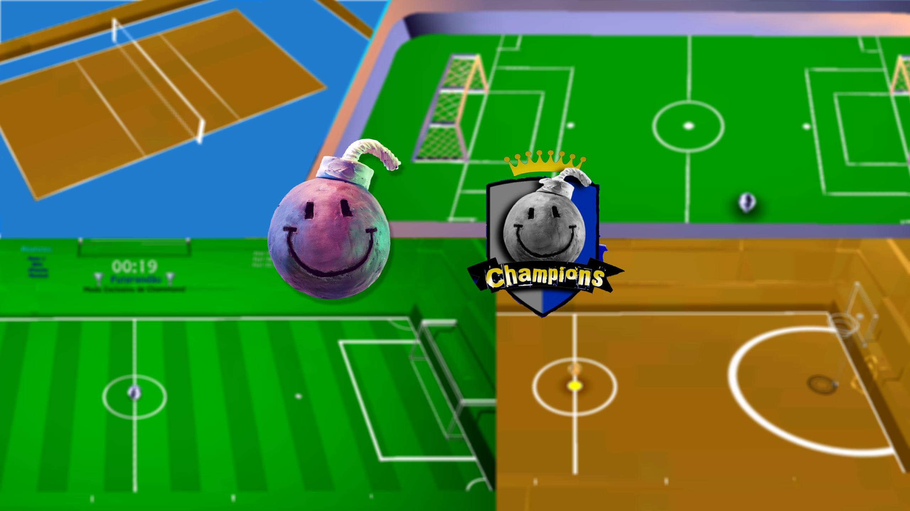
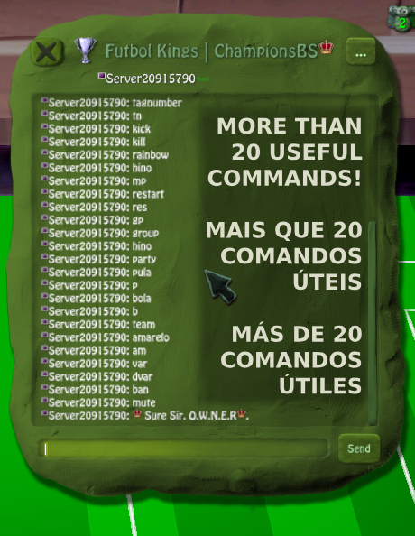
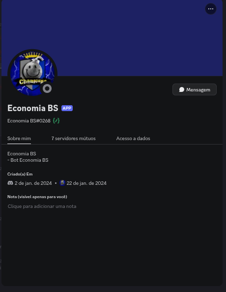

# Champions Bombsquad

🌐 Available in [Português 🇧🇷](./README.pt-br.md) | [Español 🇪🇸](./README.es.md)

Champions BS was a multiplayer server for BombSquad active from 2023 to 2025, focused on exclusive sports minigames, and made a strong visual and mechanical impact on the BombSquad sports minigame scene.

## 📦 Stack
- AWS EC2  
- Python + Ballistica API  
- Discord Bots + Webhooks  
- Logging and moderation system  
- Infrastructure using tmux sessions for multiple simultaneous servers  

## 🧠 Impact
- Active from 2023 to 2025  
- High availability during operation  
- Revolutionized the visual style and mechanics of BombSquad soccer minigames  
- Over 600 players in the Discord community at its peak  
- More than 3 exclusive sports minigames developed  
- Exclusive tournament economy system via Discord bot  
- Best-selling game of the project: **Futgrandão**

## 🖼️ Previews

### 🎮 Gameplay
- Exclusive modes like **FutGrandão, Volleyball, and Basketball**  
- Customized multiplayer BombSquad experience

### 🛠️ Moderator Panel
- Real-time admin tools and logs  
- Chat-based server moderation system

### 🤖 Economy Bot
- Tournament currency system  
- Player management via Discord  
- Full Discord integration

## 🎥 Trailers

Watch the official trailers on YouTube:  
[Champions BombSquad – Official Channel](https://www.youtube.com/@ChampionsBombSquad)  

*Includes 2 trailers showcasing gameplay and exclusive content.*

## ❌ Code is private for commercial reasons  
This repository is for portfolio and presentation purposes only.

---

## 👥 Team

- Maycon Soares – Founder and Lead Developer  
- Lucas – Co-founder and General Director  
- Finin – Co-founder and General Director  
- Matrix, Socrates, and Leal – General Administrators  

## 🌐 Contact
- 🧠 [LinkedIn](https://linkedin.com/in/devmaycon/)  
- 💻 [GitHub](https://github.com/devmaycon/)  
- 🎮 [YouTube - Champions BombSquad](https://www.youtube.com/@ChampionsBombSquad)

## 🤝 Special Thanks
Thanks to everyone who supported and contributed to this project during its development.

---

<b>Thanks for checking out my project.</b>

