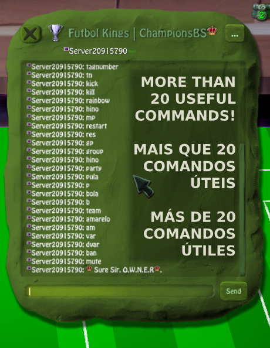

# Champions Bombsquad

🌐 Este README também está disponível em [English 🇺🇸](./README.md) | [Español 🇪🇸](./README.es.md)

Champions BS foi um servidor multiplayer para BombSquad ativo entre 2023 e 2025, focado em minigames esportivos exclusivos, e causou extremo impacto visual e mecânico no cenário dos minigames esportivos no BombSquad.

## 📦 Stack
- AWS EC2  
- Python + Ballistica API  
- Discord Bots + Webhooks  
- Sistema de logs e moderação  
- Infraestrutura com sessões tmux para múltiplos servidores simultâneos  

## 🧠 Impacto
- Projeto ativo entre 2023 e 2025  
- Alta disponibilidade durante operação  
- Revolucionou o estilo visual e as mecânicas dos minigames de futebol no BombSquad  
- Comunidade com mais de 600 jogadores no Discord no auge  
- Mais de 3 minigames de esportes exclusivos desenvolvidos  
- Sistema de economia exclusivo para torneios via bot Discord  
- Minigame mais vendido da base: **Futgrandão**  

## 🖼️ Prévias

### 🎮 Gameplay
- Modos exclusivos como **FutGrandão, Vôlei e Basketball**  
- Experiência personalizada para multiplayer BombSquad

### 🛠️ Painel do Moderador
- Ferramentas de administração e logs em tempo real  
- Sistema moderação de servidores em chat

### 🤖 Bot de Economia
- Gerenciamento de moedas em torneios  
- Gerenciamento de jogadores via Discord  
- Integração com Discord

## 🎥 Trailers

Assista aos trailers oficiais no canal do YouTube:  
[Champions BombSquad - Canal Oficial](https://www.youtube.com/@ChampionsBombsquad)  

*Contém 2 trailers oficiais mostrando gameplay e novidades exclusivas.*

## ❌ Código privado por motivos comerciais  
Este repositório serve apenas como portfólio demonstrativo.

---

## 👥 Equipe

- Maycon Soares – Fundador e Desenvolvedor  
- Lucas – Co-fundador e Diretor Geral  
- Finin – Co-fundador e Diretor Geral  
- Matrix, Socrates e Leal – Administradores Gerais  

## 🌐 Contato
- 🧠 [LinkedIn](https://linkedin.com/in/devmaycon/)  
- 💻 [GitHub](https://github.com/devmaycon/)  
- 🎮 [YouTube - Champions BombSquad](https://www.youtube.com/@ChampionsBombsquad)

## 🤝 Agradecimentos Especiais
Agradeço a todos que colaboraram e apoiaram este projeto ao longo do desenvolvimento.

---

<b>Obrigado por conferir meu projeto.</b>

